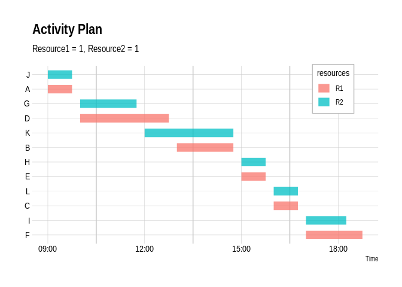

<!-- README.md is generated from README.Rmd. Please edit that file -->

# ralplan

## Specify tasks

List the name, duration, priority and resources required for yourtasks.

``` r
A  <- T(name = "A",time =  duration("1 hour"), priority = 1, resources = list(R1 = 1))
B  <- T(name = "B",time =  duration("2 hour"), priority = 1, resources = list(R1 = 1))
C  <- T(name = "C",time =  duration("1 hour"), priority = 1, resources = list(R1 = 1))
D  <- T(name = "D",time =  duration("3 hour"), priority = 1, resources = list(R1 = 1))
E  <- T(name = "E",time =  duration("1 hour"), priority = 1, resources = list(R1 = 1))
F  <- T(name = "F",time =  duration("2 hour"), priority = 1, resources = list(R1 = 1))
G  <- T(name = "G",time =  duration("2 hour"), priority = 1, resources = list(R2 = 1))
H  <- T(name = "H",time =  duration("1 hour"), priority = 1, resources = list(R2 = 1))
I  <- T(name = "I",time =  duration("1.5 hour"), priority = 1, resources = list(R2 = 1))
J  <- T(name = "J",time =  duration("1 hour"), priority = 1, resources = list(R2 = 1))
K  <- T(name = "K",time =  duration("3 hour"), priority = 1, resources = list(R2 = 1))
L  <- T(name = "L",time =  duration("1 hour"), priority = 1, resources = list(R2 = 1))
```

## Specify task dependencies

List your task dependences. (Your tasks from the previous step are now
functions!)

``` r
plan <- 
 C(after(B)) + 
 B(after(A)) +
 F(after(E)) + 
 E(after(D)) +
 L(after(K)) + 
 K(after(J)) +
 I(after(H)) + 
 H(after(G))
```

## Execute your plan

Specify the resourcews you have available and your blocks of time, then
plot the result.

``` r
result <- 
  execute( 
    plan, 
    resource_pool = list(R1 = 1, R2 = 1),
    timeslots = create_work_times(n = 4*24,15)
  )

p <- plot_executed_plan(result)
p + ggtitle("Activity Plan", "Resource1 = 1, Resource2 = 1") 
```



### What if you had double the resources?

``` r
result <- 
  execute( 
    plan, 
    resource_pool = list(R1 = 2, R2 = 2),
    timeslots = create_work_times(n = 4*24,15)
  )

p <- plot_executed_plan(result)
p + ggtitle("Activity Plan", "Resource1 = 2, Resource2 = 2") 
```


