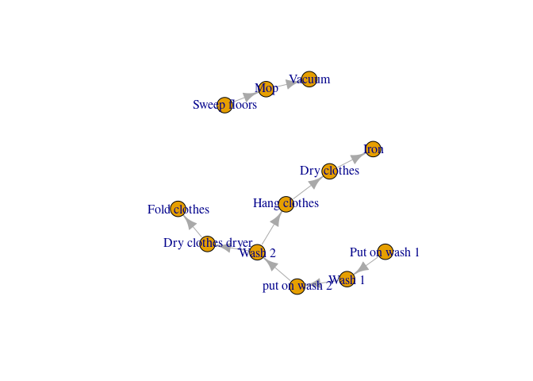

<!-- README.md is generated from README.Rmd. Please edit that file -->

# ralplan

``` r
separate_egg <- 
  T(name = "Separate egg", time = duration("5 minutes"), 
    priority = 10, resources = list(cook = 1))

lemon_filling <- 
  T(name = "Make lemon filling", time = duration("10 minutes"), 
    priority = 10, resources = list(cook = 1))

make_meringue <- 
  T(name = "Make meringue", time = duration("10 minutes"), 
    priority = 10, resources = list(cook = 1))

crust <- 
  T(name = "Fill crust", time = duration("5 minutes"), 
   priority = 10, resources = list(cook = 1))

add_meringue <- 
  T(name = "Add meringue", time = duration("5 minutes"), 
    priority = 10, resources = list(cook = 1))
```

``` r
plan <- 
 add_meringue(after(make_meringue), after(crust)) +
 lemon_filling(after(separate_egg)) + 
 make_meringue(after(separate_egg)) + 
 crust(after(lemon_filling))  

plot(form(plan))
```



``` r
result <- 
  execute( 
    plan, 
    resource_pool = list(cook = 1),
    timeslots = create_work_times(n = 60,1)
  )

plot_executed_plan(result)
```


``` r
result <- 
  execute( 
    plan, 
    resource_pool = list(cook = 2),
    timeslots = create_work_times(n = 60,1)
  )

plot_executed_plan(result)
```


